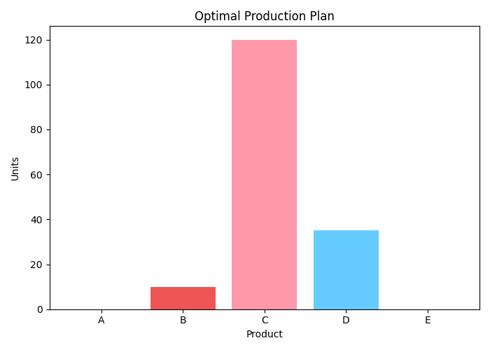

# Task 4 — Production Optimization (PuLP)

## 📌 Problem Statement
The goal of this task is to **maximize profit** while respecting resource and demand constraints.  
We use **Linear Programming (PuLP)** to determine the optimal production plan across five products (A–E).

---

## ⚙️ Methodology
- **Decision Variables**: Units of each product (A–E) to produce.  
- **Objective Function**: Maximize total profit.  
- **Constraints**:
  - Labor hours
  - Machine hours
  - Raw material availability
  - Budget limits
  - Demand restrictions

---

## ✅ Results
- **Solver Status**: Optimal  
- **Maximum Profit**: `1835.0`  
- **Optimal Production Plan**:
  - Product A → 0 units  
  - Product B → 10 units  
  - Product C → 120 units  
  - Product D → 35 units  
  - Product E → 0 units  

---

## 📊 Visualization
Optimal production plan chart:

---

## 🔎 Insights
- **Product C dominates** the plan due to high profit contribution and efficient resource usage.  
- **Products B & D** are included to balance resource constraints.  
- **Products A & E** are excluded as they reduce overall profitability under current limits.  
